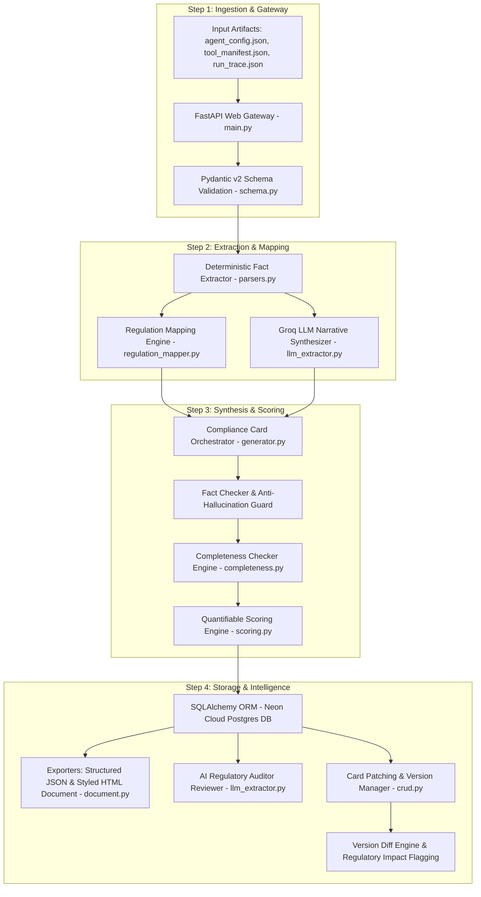

# 🎬 Master Project Documentation & Video Explanation Guide
## **Project Name**: AI Agent Compliance Card Generator  
## **Hackathon Track**: Problem Statement 6.1 — AI Agent Governance Hackathon 2026  
## **Live AWS Deployment URL**: [http://agent-compliance-card-generator--env.eba-ppijekau.ap-south-1.elasticbeanstalk.com/](http://agent-compliance-card-generator--env.eba-ppijekau.ap-south-1.elasticbeanstalk.com/)  
## **Interactive Swagger API Docs**: [http://agent-compliance-card-generator--env.eba-ppijekau.ap-south-1.elasticbeanstalk.com/docs](http://agent-compliance-card-generator--env.eba-ppijekau.ap-south-1.elasticbeanstalk.com/docs)  
## **GitHub Repository**: [https://github.com/PoorvikaGowda23/Aivar_Hackathon_AWS_22PD10](https://github.com/PoorvikaGowda23/Aivar_Hackathon_AWS_22PD10)

---

# 📑 TABLE OF CONTENTS
1. [Executive Summary & Problem Statement](#-1-executive-summary--problem-statement)
2. [Solution Approach & Core Capabilities](#-2-solution-approach--core-capabilities)
3. [System Architecture & Step-by-Step Data Flow](#-3-system-architecture--step-by-step-data-flow)
4. [AWS Cloud Deployment & CI/CD Architecture](#-4-aws-cloud-deployment--cicd-architecture)
5. [Complete Module-by-Module Code Map](#-5-complete-module-by-module-code-map)
6. [Exact Word-for-Word Video Explanation Script](#-6-exact-word-for-word-video-explanation-script)
7. [Step-by-Step UI & API Demo Walkthrough](#-7-step-by-step-ui--api-demo-walkthrough)
8. [Regulatory Compliance Mapping Matrix](#-8-regulatory-compliance-mapping-matrix)
9. [Project Accomplishments & Verification Summary](#-9-project-accomplishments--verification-summary)

---

## 📌 1. EXECUTIVE SUMMARY & PROBLEM STATEMENT

### The Problem Statement (Problem 6.1 — AI Agent Governance):
As artificial intelligence transitions from simple Q&A chatbots to **autonomous operational AI agents** capable of executing database writes, financial transfers, third-party API calls, and accessing sensitive Personally Identifiable Information (PII), regulatory frameworks worldwide demand strict transparency, risk tracking, and human oversight controls.

However, current software development practices face critical governance challenges:
* **Lack of Machine-Readable Standards**: AI agents are deployed without standardized, machine-readable specifications describing their tool inventories, authority levels, or data access boundaries.
* **Non-Scalable Manual Audits**: Traditional legal compliance reviews take weeks, relying on manual documents that cannot keep up with continuous software deployment cycles.
* **LLM Hallucination Risks**: Pure LLM generation for compliance documents introduces severe risks of inventing safeguards or misrepresenting system capabilities.
* **Unmonitored Configuration Drift**: When developers update an agent's permissions or decision authority, there is no automated system to flag whether a **Regulatory Re-Assessment** is legally required under the EU AI Act.

### The Solution:
The **AI Agent Compliance Card Generator** is an automated, production-grade governance platform. By ingesting an AI agent's operational artifacts—its configuration file (`agent_config.json`), tool manifest (`tool_manifest.json`), and execution trace (`run_trace.json`) — the platform automatically generates a standardized, audit-ready **Compliance Card** grounded in:
1. **EU AI Act**: Article 13 (System Transparency) & Article 14 (Human Oversight & Intervention Protocols).
2. **NIST AI RMF 1.0**: GOVERN 1.2 (Risk Management) & MAP 2.1 / 3.5 (Resource & Capability Mapping).
3. **ISO/IEC 42001:2023**: AI Management System controls & incident escalation procedures.

---

## 🚀 2. SOLUTION APPROACH & CORE CAPABILITIES

1. **Dual-Track Zero-Hallucination Pipeline**: Combines deterministic JSON parsing (`parsers.py`) for ground-truth facts with Groq LLM inference (`llm_extractor.py`) for narrative operational boundaries and limitation synthesis.
2. **Quantifiable 0–100 Compliance & Risk Scoring Engine**: Evaluates cards across 4 weighted pillars (Completeness 40%, Governance 30%, Privacy 15%, Autonomy 15%), assigning risk levels (`LOW_RISK`, `MODERATE_RISK`, `HIGH_RISK`), grades (`A+` to `F`), and color badges (🟢/🟡/🔴).
3. **AI-Powered Regulatory Auditor Reviewer**: Employs Groq LLaMA 3.3 70B acting as a Senior Compliance Auditor to classify the system under the EU AI Act, identify governance gaps, and produce developer remediation roadmaps.
4. **Rule-Based Completeness Checker**: Evaluates mandatory fields and detects missing attributes or placeholder tokens (`TBD`, `N/A`, `TODO`).
5. **Immutable Card Patching & Versioning**: Enables partial field updates via `PATCH` while storing immutable database version records (`v1` ➔ `v2`).
6. **Field-by-Field Regulatory Diff Engine**: Compares stored versions and flags changes in risk class, decision authority, data sources, or tool capabilities as **`⚠️ REGULATORY RE-ASSESSMENT REQUIRED`**.
7. **Print-Ready HTML & Structured JSON Exporters**: Renders executive glassmorphism HTML documents with regulatory citation badges and print-to-PDF support, along with machine-readable JSON exports.

---

## 📐 3. SYSTEM ARCHITECTURE & STEP-BY-STEP DATA FLOW

### System Data Pipeline Diagram

### Step-by-Step Data Flow Execution:
1. **Data Ingestion (`main.py` & `schema.py`)**: The user uploads `agent_config.json`, `tool_manifest.json`, and `run_trace.json`. Pydantic schemas validate file format integrity.
2. **Deterministic Fact Extraction (`parsers.py`)**: Parses ground-truth capabilities—allowed tool operations (`read`/`write`/`execute`), data sensitivities (`PII`/`confidential`), decision authority (`advisory`/`autonomous`), human oversight triggers, and incident contacts.
3. **Regulation Citation Mapping (`regulation_mapper.py`)**: Applies exact regulatory citations (EU AI Act Art 13/14, NIST AI RMF, ISO 42001) to specific sections.
4. **LLM Narrative Synthesis (`llm_extractor.py`)**: Invokes Groq LLaMA 3.3 70B / Qwen to synthesize `purpose_and_scope` and infer `known_limitations` strictly from execution logs.
5. **Anti-Hallucination Verification & Completeness (`completeness.py`)**: Fact Checker Guard cross-verifies LLM text against deterministic facts. The Completeness Checker inspects all mandatory fields for missing data or placeholders.
6. **Quantifiable Risk Scoring (`scoring.py`)**: Computes weighted scores across 4 pillars (Completeness 40%, Governance 30%, Data Privacy 15%, Operational Autonomy 15%) to output a final 0-100 score, grade, and color badge.
7. **Database Persistence & Exporters (`crud.py` & `document.py`)**: Saves immutable version `v1` to Neon Cloud Postgres, and generates styled HTML documents and JSON exports.
8. **AI Audit & Version Diffing (`llm_extractor.py` & `main.py`)**: Executes senior compliance auditor critique reports. On `PATCH` updates, creates version `v2` and triggers the version diff engine to flag regulatory re-assessment warnings.

---

## ☁️ 4. AWS CLOUD DEPLOYMENT & CI/CD ARCHITECTURE

- 🚀 **AWS Elastic Beanstalk**: Hosts the Python 3.11 FastAPI application on Amazon Linux 2023. Configured with environment properties (`DATABASE_URL`, `GROQ_API_KEY`, `LOG_LEVEL`) and deep health monitoring (`/health?full=true`).
- 🔄 **AWS CodePipeline GitHub CI/CD**: Automated integration connected directly to GitHub repository (`PoorvikaGowda23/Aivar_Hackathon_AWS_22PD10`). Every `git push origin main` automatically triggers a CodePipeline build, zero-downtime deployment, and environment update.
- 🐘 **Neon Serverless PostgreSQL**: Production cloud database managing immutable version histories and audit logs.

---

## 🧩 5. COMPLETE MODULE-BY-MODULE CODE MAP

> *Explain what each module does and where it is used in the workflow:*

| Python Module | File Path | Core Role & Where Used |
| :--- | :--- | :--- |
| **Gateway & Routes** | [`app/main.py`](file:///c:/Users/user/Desktop/VSC%20Folder/Aivar_Hackathon_AWS_22PD10/app/main.py) | FastAPI app, REST endpoints, Request-ID middleware, CORS, exception handlers, and `/health?full=true` deep health check. |
| **Orchestrator** | [`app/generator.py`](file:///c:/Users/user/Desktop/VSC%20Folder/Aivar_Hackathon_AWS_22PD10/app/generator.py) | Master pipeline controller linking parsers, regulation mapper, LLM calls, and card assembly. |
| **Fact Extractor** | [`app/parsers.py`](file:///c:/Users/user/Desktop/VSC%20Folder/Aivar_Hackathon_AWS_22PD10/app/parsers.py) | Deterministic parser extracting tool inventory, permissions, PII sensitivities, authority tiers, and oversight triggers. |
| **Regulation Engine** | [`app/regulation_mapper.py`](file:///c:/Users/user/Desktop/VSC%20Folder/Aivar_Hackathon_AWS_22PD10/app/regulation_mapper.py) | Applies EU AI Act (Art 13/14), NIST AI RMF, and ISO 42001 citations to card sections. |
| **Groq LLM Engine** | [`app/llm_extractor.py`](file:///c:/Users/user/Desktop/VSC%20Folder/Aivar_Hackathon_AWS_22PD10/app/llm_extractor.py) | Groq LLaMA 3.3 70B interface for narrative synthesis and the **AI Regulatory Auditor** review engine. |
| **Scoring Engine** | [`app/scoring.py`](file:///c:/Users/user/Desktop/VSC%20Folder/Aivar_Hackathon_AWS_22PD10/app/scoring.py) | 4-pillar 0-100 compliance & risk calculator (`Completeness`, `Governance`, `Privacy`, `Autonomy`). |
| **Completeness Engine**| [`app/completeness.py`](file:///c:/Users/user/Desktop/VSC%20Folder/Aivar_Hackathon_AWS_22PD10/app/completeness.py) | Quality assurance engine checking mandatory field population and detecting placeholder tokens (`TBD`, `N/A`, `TODO`). |
| **Exporters** | [`app/document.py`](file:///c:/Users/user/Desktop/VSC%20Folder/Aivar_Hackathon_AWS_22PD10/app/document.py) | Converts internal data models into structured JSON and styled HTML documents. |
| **Schemas & Models** | [`app/schema.py`](file:///c:/Users/user/Desktop/VSC%20Folder/Aivar_Hackathon_AWS_22PD10/app/schema.py) / [`app/models.py`](file:///c:/Users/user/Desktop/VSC%20Folder/Aivar_Hackathon_AWS_22PD10/app/models.py) | Pydantic domain models for validation & SQLAlchemy ORM models for DB persistence. |
| **DB & CRUD Layer** | [`app/crud.py`](file:///c:/Users/user/Desktop/VSC%20Folder/Aivar_Hackathon_AWS_22PD10/app/crud.py) / [`app/database.py`](file:///c:/Users/user/Desktop/VSC%20Folder/Aivar_Hackathon_AWS_22PD10/app/database.py) | Database connection pool (SQLite dev / Neon Postgres prod) and version history persistence. |
| **UI Portal** | [`app/portal.py`](file:///c:/Users/user/Desktop/VSC%20Folder/Aivar_Hackathon_AWS_22PD10/app/portal.py) | Interactive glassmorphism single-page web dashboard frontend. |

---

## 🎙️ 6. EXACT WORD-FOR-WORD VIDEO EXPLANATION SCRIPT

### 🎬 SECTION 1: INTRODUCTION & PROBLEM STATEMENT (0:00 - 1:15)

**On Screen**: Show Project Title Slide or Live Web Portal Homepage.

**Spoken Dialogue**:
> *"Hello everyone! I am presenting our project for **Problem Statement 6.1 — AI Agent Governance**: the **AI Agent Compliance Card Generator**.*
>
> *As artificial intelligence transitions from simple Q&A chatbots to autonomous operational actors—capable of executing database writes, financial API calls, and handling sensitive PII data—regulatory frameworks like the **EU AI Act**, **NIST AI RMF 1.0**, and **ISO 42001** demand strict transparency, risk tracking, and human oversight controls.*
>
> *However, traditional manual compliance reviews take weeks and cannot scale with daily code deployments. Our project solves this by automatically ingesting an AI agent's raw configuration (`agent_config.json`), tool manifest (`tool_manifest.json`), and execution traces (`run_trace.json`) to generate an audit-ready, regulation-mapped **Compliance Card** in seconds.*
>
> *Our solution bridges technical runtime execution with legal compliance obligations through deterministic fact extraction, Groq LLM narrative synthesis, a multi-pillar scoring engine, and an automated AI Regulatory Auditor."*

---

### 🎬 SECTION 2: SYSTEM ARCHITECTURE & DATA FLOW (1:15 - 2:45)

**On Screen**: Display Architecture Diagram & Data Flow Diagram.

**Spoken Dialogue**:
> *"Now let me walk you through our **System Architecture** and step-by-step data pipeline.*
>
> *When raw JSON artifacts are uploaded to our **FastAPI Web Gateway**, Pydantic v2 schemas validate input integrity. The pipeline then operates on two parallel tracks:*
>
> *First, our **Deterministic Fact Extractor (`parsers.py`)** extracts ground-truth facts directly from JSON—such as tool operation permissions (`read`/`write`/`execute`), PII sensitivity levels, decision authority tiers (`advisory` vs `autonomous`), human oversight triggers, and incident contacts. This guarantees 100% factual accuracy with zero hallucination risk.*
>
> *Simultaneously, our **Regulation Mapping Engine (`regulation_mapper.py`)** applies precise regulatory citations from EU AI Act Article 13 and Article 14, NIST AI RMF, and ISO 42001 controls.*
>
> *Next, our **Groq LLM Narrative Synthesizer (`llm_extractor.py`)** uses Groq LLaMA 3.3 70B to synthesize human-readable operational boundaries and infer technical limitations strictly from runtime execution logs.*
>
> *The card is then passed to our **Fact Checker Guard** and **Completeness Checker (`completeness.py`)** to detect missing fields or placeholder strings like `TBD` or `TODO`.*
>
> *Our **Scoring Engine (`scoring.py`)** evaluates the card across four weighted pillars—Completeness, Governance, Privacy, and Autonomy—outputting a quantifiable 0-100 score, letter grade (A+ to F), and risk badge (🟢/🟡/🔴).*
>
> *Finally, the card is saved as an immutable version in **Neon Cloud Serverless Postgres DB** and rendered as a styled HTML document or JSON export.*
>
> *Our application is deployed on **AWS Elastic Beanstalk** with automated **AWS CodePipeline CI/CD** connected to GitHub. Every `git push origin main` triggers a zero-downtime deployment."*

---

### 🎬 SECTION 3: CODEBASE MODULE MAP OVERVIEW (2:45 - 3:45)

**On Screen**: Show VS Code editor workspace tree showing `app/` modules.

**Spoken Dialogue**:
> *"Let's take a quick look at how our backend is structured in `app/`:*
> - *`main.py` serves as the FastAPI Web Gateway hosting all REST routes, middleware, and `/health?full=true` deep health checks.*
> - *`generator.py` is the orchestrator coordinating parsers, LLM calls, and schema building.*
> - *`parsers.py` contains deterministic extraction logic for tools, PII, and oversight triggers.*
> - *`regulation_mapper.py` encapsulates all EU AI Act, NIST AI RMF, and ISO 42001 citation mapping rules.*
> - *`llm_extractor.py` integrates Groq API for narrative generation and houses our AI Regulatory Auditor.*
> - *`scoring.py` implements our multi-pillar 0-100 compliance and risk scoring formula.*
> - *`completeness.py` performs quality checking for placeholder detection.*
> - *`document.py` renders print-ready HTML cards and structured JSON exports.*
> - *`crud.py` and `database.py` manage Neon Cloud Postgres connection pooling and version storage.*
> - *`portal.py` serves our interactive single-page web dashboard."*

---

### 🎬 SECTION 4: LIVE DEMO WALKTHROUGH (3:45 - 6:00)

**On Screen**: Open live AWS deployment URL: `http://agent-compliance-card-generator--env.eba-ppijekau.ap-south-1.elasticbeanstalk.com/`

**Spoken Dialogue & Actions**:

1. **Portal Dashboard**:
   - *Action*: Show the main dashboard listing registered agents.
   - *Say*: *"Here is our live Web Portal hosted on AWS Elastic Beanstalk. It presents an executive dashboard displaying all registered AI agents, their compliance score, letter grade, and risk badge."*

2. **Generate Compliance Card**:
   - *Action*: Click **"Generate Compliance Card"**, select sample input files (`agent_config.json`, `tool_manifest.json`, `run_trace.json`), and hit **Generate**.
   - *Say*: *"Uploading raw agent artifacts triggers our FastAPI pipeline. In seconds, it extracts facts, invokes Groq LLaMA 3.3 70B, checks completeness, scores the card, and saves version `v1` to Neon Cloud Postgres."*

3. **View HTML Document**:
   - *Action*: Open the HTML document view. Highlight EU AI Act badges, human oversight triggers, tool inventory, and print-to-PDF button.
   - *Say*: *"Here is the rendered HTML Compliance Document. Notice the regulatory citation badges for EU AI Act Article 13 and Article 14."*

4. **Compliance & Risk Score**:
   - *Action*: Show the 0-100 score dashboard and 4-pillar breakdown.
   - *Say*: *"Our scoring engine provides a 0-100 score evaluating Completeness (40%), Governance (30%), Privacy (15%), and Autonomy (15%)."*

5. **AI Regulatory Auditor Review**:
   - *Action*: Click **"Run AI Audit Review"**. Show the generated auditor critique report.
   - *Say*: *"Our AI Regulatory Auditor uses Groq LLaMA 3.3 70B acting as a Senior Compliance Auditor to classify the system under the EU AI Act, highlight governance gaps, and list remediation steps."*

6. **Card Field Patching & Version Diff**:
   - *Action*: Issue a `PATCH` update modifying human oversight triggers to create version `v2`, then compare `v1` vs `v2`.
   - *Say*: *"When an agent's configuration updates, our PATCH endpoint saves immutable version `v2`. The Version Diff Engine compares fields and flags changes as `⚠️ REGULATORY RE-ASSESSMENT REQUIRED`."*

7. **Swagger API Documentation**:
   - *Action*: Open `/docs`.
   - *Say*: *"All 13 REST API endpoints are fully documented and testable in interactive Swagger UI."*

---

### 🎬 SECTION 5: CONCLUSION & PITCH (6:00 - 6:30)

**Spoken Dialogue**:
> *"To conclude, our project achieves:*
> - *✅ **100% Core Engine Test Coverage**: 22 passing unit and integration tests.*
> - *✅ **Zero-Hallucination Guard**: Combines deterministic fact parsing with LLM narrative generation.*
> - *✅ **Production Cloud Deployment**: AWS Elastic Beanstalk with automated AWS CodePipeline CI/CD and Neon PostgreSQL DB.*
> - *✅ **Multi-Framework Governance**: Grounded in EU AI Act, NIST AI RMF, and ISO 42001.*
>
> *Thank you! The AI Agent Compliance Card Generator makes AI governance automated, transparent, and enterprise-ready."*

---

## 🖥️ 7. STEP-BY-STEP UI & API DEMO WALKTHROUGH

| Demo Step | Endpoint / UI Action | What to Showcase on Screen |
| :--- | :--- | :--- |
| **Step 1** | `GET /` | Live Portal Dashboard with agent table, scores, grades, and risk badges (🟢/🟡/🔴). |
| **Step 2** | `POST /agents/cards/generate` | Card generation form uploading `agent_config.json`, `tool_manifest.json`, `run_trace.json`. |
| **Step 3** | `GET /agents/cards/{id}/document` | Print-ready HTML card with glassmorphism styling, regulatory badges, and PDF export. |
| **Step 4** | `GET /agents/cards/{id}/score` | 0-100 score dashboard showing 4 pillar scores (Completeness, Governance, Privacy, Autonomy). |
| **Step 5** | `POST /agents/cards/{id}/review` | AI Regulatory Auditor critique report with EU AI Act classification and remediation steps. |
| **Step 6** | `PATCH /agents/cards/{id}` | Partial field update saving new version `v2` to database. |
| **Step 7** | `GET /agents/cards/{id}/diff` | Field-by-field version comparison with `⚠️ REGULATORY RE-ASSESSMENT REQUIRED` flags. |
| **Step 8** | `GET /docs` | Interactive Swagger UI API Documentation. |

---

## ⚖️ 8. REGULATORY COMPLIANCE MAPPING MATRIX

| Regulatory Clause | Standard | Mapped Compliance Card Section |
| :--- | :--- | :--- |
| **Article 13(1)** | EU AI Act | High-Level Summary & System Identity |
| **Article 13(2)** | EU AI Act | Intended Purpose & Operational Boundaries |
| **Article 13(3)(b)** | EU AI Act | Known Limitations & Technical Constraints |
| **Article 14** | EU AI Act | Human Oversight Triggers & Intervention Protocols |
| **GOVERN 1.2** | NIST AI RMF | Risk Classification & Decision Authority Level |
| **MAP 2.1** | NIST AI RMF | Data Sources & Sensitivity Categories (PII/Confidential) |
| **MAP 3.5** | NIST AI RMF | Tool Inventory & Operation Capabilities |
| **Control A.9.2** | ISO/IEC 42001 | Incident Escalation Contacts & Remediation Paths |

---

## 🏆 9. PROJECT ACCOMPLISHMENTS & VERIFICATION SUMMARY

* ✅ **100% Core Engine Test Coverage**: 22 passing unit & integration tests across 8 test suites (`python -m pytest tests/ -v`).
* ✅ **Zero-Hallucination Guard**: Combines deterministic JSON parsing with LLM text generation and fact verification.
* ✅ **Multi-Pillar Scoring Engine**: Quantifies compliance risk (0-100 score) across Completeness, Governance, Privacy, and Autonomy.
* ✅ **AI Regulatory Auditor**: Automated senior auditor critique issuing EU AI Act risk tiers and actionable remediation steps.
* ✅ **Immutable Card Patching & Versioning**: Enables partial field updates via `PATCH` while maintaining audit logs and version diffing.
* ✅ **Production AWS Cloud Deployment**: Live on AWS Elastic Beanstalk via AWS CodePipeline GitHub CI/CD connected to Neon Serverless PostgreSQL.
* ✅ **Interactive Portal & Exports**: Responsive glassmorphism web dashboard with JSON exports, version comparison, and print-ready HTML cards.
