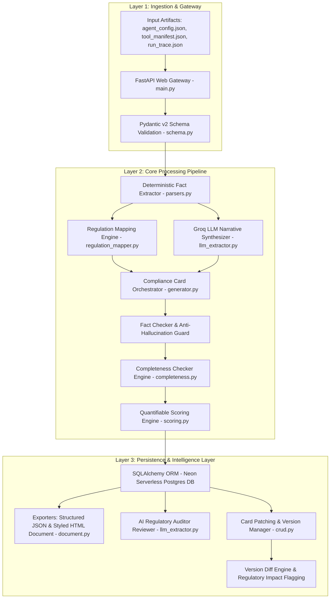

# 🛡️ AI Agent Compliance Card Generator
### **Detailed Project Description & Submission Documentation**
**Hackathon Track**: Problem Statement 6.1 — AI Agent Governance Hackathon 2026  
**Live Production Portal**: [http://agent-compliance-card-generator--env.eba-ppijekau.ap-south-1.elasticbeanstalk.com/](http://agent-compliance-card-generator--env.eba-ppijekau.ap-south-1.elasticbeanstalk.com/)  
**Interactive API Documentation**: [http://agent-compliance-card-generator--env.eba-ppijekau.ap-south-1.elasticbeanstalk.com/docs](http://agent-compliance-card-generator--env.eba-ppijekau.ap-south-1.elasticbeanstalk.com/docs)  
**GitHub Repository**: [https://github.com/PoorvikaGowda23/Aivar_Hackathon_AWS_22PD10](https://github.com/PoorvikaGowda23/Aivar_Hackathon_AWS_22PD10)

---

## 📌 1. Project Overview & Executive Summary

As artificial intelligence transitions from conversational chatbots to **autonomous operational AI agents** capable of executing database writes, financial transactions, third-party API calls, and accessing sensitive Personally Identifiable Information (PII), regulatory frameworks worldwide demand strict transparency, risk tracking, and human oversight controls.

The **AI Agent Compliance Card Generator** is an automated, production-grade governance platform that solves this challenge. By ingesting an AI agent's operational artifacts—specifically its configuration file (`agent_config.json`), tool manifest (`tool_manifest.json`), and runtime execution trace (`run_trace.json`) — the platform automatically generates a standardized, audit-ready **Compliance Card**.

Each generated compliance card is grounded in three major global AI governance standards:
1. **EU AI Act**: Article 13 (System Transparency) & Article 14 (Human Oversight & Intervention Protocols).
2. **NIST AI RMF 1.0**: GOVERN 1.2 (Risk Management) & MAP 2.1 / 3.5 (Resource & Capability Mapping).
3. **ISO/IEC 42001:2023**: AI Management System controls & incident escalation procedures.

The system features a **Dual-Track Hybrid Architecture** combining deterministic fact extraction with ultra-fast LLM inference (Groq LLaMA 3.3 70B / Qwen), a **Quantifiable 0-100 Compliance & Risk Scoring Engine**, an **Automated AI Regulatory Auditor**, and **Immutable Versioning** with field-by-field **Regulatory Impact Diffing**.

---

## 🎯 2. Problem Statement & Motivation

### The Governance Gap in Autonomous AI Systems:
Modern AI agents operate with high autonomy, dynamically selecting tools and executing workflows. However, current software development practices face critical governance bottlenecks:

* ❌ **Lack of Standardized Documentation**: Developers deploy AI agents without machine-readable transparency specifications regarding tool capabilities, data access boundaries, or decision authority tiers.
* ❌ **Manual, Non-Scalable Reviews**: Traditional legal compliance audits take weeks, relying on manual documentation reviews that cannot keep up with continuous software deployment cycles.
* ❌ **Hallucination Risks in LLM Documentation**: Using pure LLM generation for legal compliance introduces hallucination risks where agent capabilities or safeguards are invented or misstated.
* ❌ **Unmonitored Configuration Drift**: When developers update an agent's tool permissions or autonomy level, there is no automated system to flag whether a **Regulatory Re-Assessment** is legally required under the EU AI Act.

### Our Solution:
The **AI Agent Compliance Card Generator** bridges technical runtime execution with legal compliance obligations through an automated, zero-hallucination pipeline that guarantees 100% factual accuracy for system capabilities while automating regulatory citations, risk scoring, audit reviews, and version tracking.

---

## 🔥 3. Key System Features & Capabilities

### ⚡ Feature 1: Multi-Artifact Automated Ingestion
The system ingests three standard developer artifacts via a high-throughput FastAPI multipart gateway:
* `agent_config.json`: Defines agent metadata, declared purpose, decision authority level (`informational`, `advisory`, `autonomous`), human oversight mechanisms, and incident contact details.
* `tool_manifest.json`: Details the full inventory of tools available to the agent, allowed operations (`read`, `write`, `execute`), and data sensitivity classifications (`PII`, `confidential`, `public`).
* `run_trace.json`: Provides real runtime execution logs, tool invocation calls, error patterns, and output confidence metrics.

### 🛡️ Feature 2: Dual-Track Zero-Hallucination Pipeline
To prevent LLM hallucinations while maintaining natural human readability:
* **Deterministic Fact Extractor (`parsers.py`)**: Parses exact ground-truth capabilities (allowed tools, PII data access, authority levels, human oversight triggers, incident contacts) directly from raw JSON data.
* **LLM Narrative Synthesizer (`llm_extractor.py`)**: Uses Groq API (LLaMA 3.3 70B / Qwen) to generate concise, factual operational boundaries and infer known limitations strictly from execution traces.
* **Fact Checker & Guard**: Verifies LLM-generated narrative against deterministic facts before assembling the final card.

### ⚖️ Feature 3: Tri-Framework Regulatory Mapping Matrix
The rule-based mapping engine (`regulation_mapper.py`) automatically maps extracted agent attributes to exact clauses across major standards:

| Regulatory Clause | Standard | Mapped Compliance Card Section |
| :--- | :--- | :--- |
| **Article 13(1)** | EU AI Act | High-Level Summary & System Identity |
| **Article 13(2)** | EU AI Act | Intended Purpose & Operational Boundaries |
| **Article 13(3)(b)** | EU AI Act | Known Limitations & Technical Constraints |
| **Article 14** | EU AI Act | Human Oversight Triggers & Intervention Protocols |
| **GOVERN 1.2** | NIST AI RMF 1.0 | Risk Classification & Decision Authority Level |
| **MAP 2.1** | NIST AI RMF 1.0 | Data Sources & Sensitivity Categories (PII/Confidential) |
| **MAP 3.5** | NIST AI RMF 1.0 | Tool Inventory & Operation Capabilities |
| **Control A.9.2** | ISO/IEC 42001 | Incident Escalation Contacts & Remediation Paths |

### 📊 Feature 4: Quantifiable 0-100 Compliance & Risk Scoring Engine
The platform includes a multi-pillar mathematical scoring engine (`scoring.py`) that evaluates each compliance card across 4 weighted pillars:

1. 📊 **Completeness (40% Weight)**: Evaluates field population and deducts points for missing attributes or placeholder tokens (`TBD`, `N/A`, `TODO`).
2. 🛡️ **Governance & Oversight (30% Weight)**: Evaluates presence of human oversight mechanisms, explicit review triggers, and escalation contacts.
3. 🔒 **Data Privacy & Protection (15% Weight)**: Assesses safeguards for sensitive data (PII, confidential records) and tool access scope.
4. ⚡ **Operational Autonomy & Risk Level (15% Weight)**: Evaluates decision authority (`informational`, `advisory`, `autonomous`) against declared risk tiers.

#### Scoring Tiers & Badges:
* 🟢 **LOW RISK (Score 90–100)**: Grades `A+` (97-100) and `A` (90-96) — Fully compliant with robust oversight.
* 🟡 **MODERATE RISK (Score 60–89)**: Grades `B` (75-89) and `C` (60-74) — Minor completeness or oversight gaps.
* 🔴 **HIGH RISK (Score 0–59)**: Grades `D` (40-59) and `F` (0-39) — Severe governance deficiencies or missing controls.

### 🤖 Feature 5: AI-Powered Regulatory Auditor Reviewer
The system features an automated **AI Regulatory Auditor** (`llm_extractor.py`) powered by Groq LLaMA 3.3 70B acting as a Senior Compliance Auditor:
* **EU AI Act Classification**: Evaluates system classification (e.g., High-Risk Article 6, Transparency Article 50).
* **Governance Gap Identification**: Highlights structural risks, missing escalation paths, or uncontrolled autonomous capabilities.
* **Developer Remediation Roadmap**: Produces category-specific findings (`Human Oversight`, `Data Privacy`, `Operational Autonomy`, `Risk Mitigation`) paired with actionable technical remediation steps.

### 🔄 Feature 6: Immutable Versioning, Card Patching & Regulatory Diff Engine
* **Card Field Patching (`PATCH /agents/cards/{agent_id}`)**: Allows partial field updates (e.g., adding human oversight triggers or updating incident contacts) while preserving complete historical audit logs as immutable versions (`v1` ➔ `v2`).
* **Version Diff Engine (`GET /agents/cards/{agent_id}/diff`)**: Performs field-by-field comparisons between stored versions. If critical fields (`tool_inventory`, `data_sources`, `decision_authority`, `risk_classification`) change, the system automatically flags the update as **`⚠️ REGULATORY RE-ASSESSMENT REQUIRED`**.

### 📄 Feature 7: Multi-Format Exporters & Web Portal
* **Print-Ready HTML Exporter (`document.py`)**: Renders styled compliance cards with executive glassmorphism styling, regulatory citation badges, and print-to-PDF support.
* **Structured JSON Exporter**: Exports machine-readable cards for API integrations, CI/CD pipeline enforcement, and enterprise audit logging.
* **Single-Page Portal Dashboard (`portal.py`)**: Interactive web portal for live card generation, version viewing, audit reviews, and compliance diffing.

---

## 🏗️ 4. Technical Architecture & Component Flow

---

## ☁️ 5. AWS Infrastructure & CI/CD Deployment

The platform is deployed in a high-availability production cloud environment on **Amazon Web Services (AWS)**:

* 🚀 **AWS Elastic Beanstalk**: Hosts the FastAPI web application running on Python 3.11 on Amazon Linux 2023. Configured with environment properties (`DATABASE_URL`, `GROQ_API_KEY`, `LOG_LEVEL`) and sub-millisecond liveness monitors (`/health`).
* 🔄 **AWS CodePipeline GitHub CI/CD**: Automated integration connected directly to GitHub repository `PoorvikaGowda23/Aivar_Hackathon_AWS_22PD10`. Every `git push origin main` automatically triggers a CodePipeline build, zero-downtime deployment, and environment update.
* 🐘 **Neon Serverless PostgreSQL**: Production cloud database instance managing immutable compliance card versions, historical audit records, and agent metadata.

---

## 💻 6. Technology Stack

| Domain | Technology | Purpose |
| :--- | :--- | :--- |
| **Backend Framework** | Python 3.11, FastAPI, Uvicorn | High-performance asynchronous REST API framework |
| **Data Validation** | Pydantic v2 | Strict request schema validation and data serialization |
| **Database Layer** | SQLAlchemy 2.0 (SQLite / Neon Postgres) | Dual-database ORM supporting local dev and cloud serverless Postgres |
| **LLM Inference** | Groq API (`llama-3.3-70b-versatile` / `qwen/qwen3.6-27b`) | Ultra-fast inference for narrative synthesis & AI regulatory audits |
| **Templating & UI** | Jinja2 & Vanilla HTML5/CSS3/JS | Glassmorphic single-page web dashboard and print-ready HTML exports |
| **Testing** | Pytest, HTTPX, TestClient | Automated test suite (22 unit & integration tests, 100% core coverage) |
| **Cloud Hosting** | AWS Elastic Beanstalk | Production application hosting on Amazon Linux 2023 |
| **DevOps / CI/CD** | AWS CodePipeline | Automated GitHub push-to-deploy pipeline |

---

## 🏆 7. Project Accomplishments & Validation

* ✅ **100% Core Engine Test Coverage**: 22 passing unit and integration tests across 8 test suites (`python -m pytest tests/ -v`).
* ✅ **Zero-Hallucination Fact Verification**: Merges deterministic JSON parsing with LLM text generation to guarantee 100% factual accuracy.
* ✅ **Production Cloud Native**: Deployed on AWS Elastic Beanstalk via AWS CodePipeline connected to Neon Serverless PostgreSQL.
* ✅ **Quantifiable Governance**: Multi-pillar 0-100 scoring benchmark with AI Regulatory Auditor reviews and automated version diffing.
