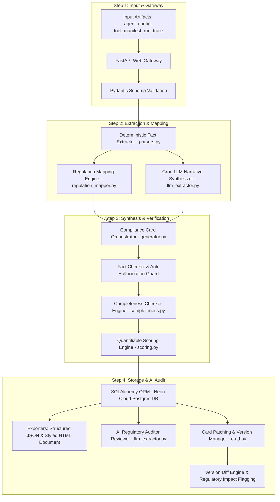

# 🎥 Project Presentation & Video Explanation Guide
## **Project**: AI Agent Compliance Card Generator
## **Hackathon Track**: Problem Statement 6.1 — AI Agent Governance Hackathon 2026
## **Live AWS URL**: [http://agent-compliance-card-generator--env.eba-ppijekau.ap-south-1.elasticbeanstalk.com/](http://agent-compliance-card-generator--env.eba-ppijekau.ap-south-1.elasticbeanstalk.com/)

---

## 💡 Key Advice: Explaining Data Flow with Architecture

> **Yes! It is significantly better to explain the step-by-step data flow *WHILE* walking through the System & Pipeline Architecture.**  
> When you explain how data enters the system and moves through each component step-by-step, judges can immediately understand *how* your architecture solves the problem rather than just looking at a static list of components.

---

## ⏱️ Video Presentation Timeline (5–7 Minute Recording Plan)

| Timestamp | Section | Core Focus |
| :--- | :--- | :--- |
| **0:00 - 1:15** | **1. Problem & Solution** | The AI governance gap & how our generator bridges technical runtime to regulation. |
| **1:15 - 2:45** | **2. Architecture & Step-by-Step Data Flow** | End-to-end data pipeline flow + AWS Elastic Beanstalk & Neon DB architecture. |
| **2:45 - 4:00** | **3. Modular Code Map** | Breakdown of Python modules (`app/`) and their operational roles. |
| **4:00 - 6:15** | **4. Live Interactive UI & API Demo** | Step-by-step screen demo of portal options, HTML document, Scoring, AI Auditor & Version Diffing. |
| **6:15 - 6:45** | **5. Key Achievements & Pitch** | 22 passing tests, zero-hallucination guard, AWS CodePipeline CI/CD. |

---

## 🎙️ Section 1: Problem Statement & Solution Approach (0:00 - 1:15)

### 🗣️ Speaking Script:
> *"Hello everyone! I am presenting our solution for **Problem Statement 6.1 — AI Agent Governance**: the **AI Agent Compliance Card Generator**.*
>
> *As AI agents transition from simple chatbots to autonomous operational actors capable of database writes, API execution, and handling sensitive PII data, regulatory frameworks like the **EU AI Act**, **NIST AI RMF 1.0**, and **ISO/IEC 42001** demand strict transparency and human oversight controls.*
>
> *However, traditional manual compliance reviews are too slow and fail to scale with rapid code deployments. Our project solves this by automatically ingesting an AI agent's raw configuration (`agent_config.json`), tool manifest (`tool_manifest.json`), and execution traces (`run_trace.json`) to produce a standardized, audit-ready, regulation-aligned **Compliance Card** in seconds.*
>
> *Our system combines deterministic fact extraction with Groq LLM narrative synthesis, a multi-pillar scoring engine, and an automated AI Regulatory Auditor."*

---

## 📐 Section 2: Architecture & Step-by-Step Data Flow (1:15 - 2:45)

### 📊 System Architecture & Data Flow Diagram

### 🗣️ Step-by-Step Pipeline Flow Script (What to Explain):

1. **Step 1: Input Ingestion & Gateway (`main.py` & `schema.py`)**:
   - The user or CI/CD pipeline uploads three raw JSON files (`agent_config.json`, `tool_manifest.json`, `run_trace.json`) via the FastAPI gateway. Pydantic v2 validates file structures.
2. **Step 2: Dual-Track Extraction & Mapping (`parsers.py`, `regulation_mapper.py`, `llm_extractor.py`)**:
   - **Track A (Deterministic Parsing)**: Extracts ground-truth facts directly from JSON—tool capabilities (`read`/`write`/`execute`), PII sensitivity, authority level (`advisory`/`autonomous`), and human oversight triggers.
   - **Track B (Regulation Mapping)**: Rule engine maps extracted features to EU AI Act (Art 13/14), NIST AI RMF, and ISO 42001 clauses.
   - **Track C (Groq LLM Synthesis)**: Groq LLaMA 3.3 70B / Qwen model synthesizes human-readable operational scope and infers known limitations from runtime execution traces.
3. **Step 3: Verification & Scoring (`completeness.py` & `scoring.py`)**:
   - **Fact Checker Guard**: Cross-verifies LLM text against deterministic facts to prevent hallucinations.
   - **Completeness Checker**: Flags null values or placeholder tokens (`TBD`, `N/A`, `TODO`).
   - **Quantifiable Scoring Engine**: Evaluates card across 4 pillars (Completeness 40%, Governance 30%, Privacy 15%, Autonomy 15%) to yield a 0-100 score, letter grade (`A+` to `F`), and risk badge (🟢/🟡/🔴).
4. **Step 4: Persistence, AI Audit & Diffing (`crud.py`, `models.py`, `document.py`)**:
   - Persists immutable card version record `v1` to **Neon Serverless PostgreSQL**.
   - Generates print-ready HTML cards and structured JSON exports.
   - Runs **AI Regulatory Auditor** for senior compliance critique.
   - On updates, `PATCH` creates version `v2` and triggers the **Version Diff Engine** to flag regulatory re-assessment warnings.

---

### ☁️ AWS Cloud & CI/CD Infrastructure Architecture

- **AWS Elastic Beanstalk**: Deployed on Python 3.11 Platform running on Amazon Linux 2023.
- **AWS CodePipeline GitHub CI/CD**: Automated integration connected to GitHub repository (`PoorvikaGowda23/Aivar_Hackathon_AWS_22PD10`). Every `git push origin main` automatically triggers a build and zero-downtime deployment to AWS Elastic Beanstalk.
- **Neon Cloud Serverless PostgreSQL**: Production cloud database tier hosting immutable card histories.

---

## 🧩 Section 3: Modular Code Map & Responsibilities (2:45 - 4:00)

> *Explain what each module does and where it is used in the workflow:*

| Python Module | File Path | Core Role & Where Used |
| :--- | :--- | :--- |
| **Gateway & Routes** | [`app/main.py`](file:///c:/Users/user/Desktop/VSC%20Folder/Aivar_Hackathon_AWS_22PD10/app/main.py) | FastAPI app, REST endpoints, Request-ID tracing middleware, exception handlers, and `/health?full=true` deep health check. |
| **Orchestrator** | [`app/generator.py`](file:///c:/Users/user/Desktop/VSC%20Folder/Aivar_Hackathon_AWS_22PD10/app/generator.py) | Master pipeline controller linking parsers, regulation mapper, LLM calls, and card assembly. |
| **Fact Extractor** | [`app/parsers.py`](file:///c:/Users/user/Desktop/VSC%20Folder/Aivar_Hackathon_AWS_22PD10/app/parsers.py) | Deterministic parser extracting tool inventory, permissions, PII sensitivities, authority tiers, and oversight triggers. |
| **Regulation Engine** | [`app/regulation_mapper.py`](file:///c:/Users/user/Desktop/VSC%20Folder/Aivar_Hackathon_AWS_22PD10/app/regulation_mapper.py) | Applies EU AI Act (Art 13/14), NIST AI RMF, and ISO 42001 citations to card sections. |
| **Groq LLM Engine** | [`app/llm_extractor.py`](file:///c:/Users/user/Desktop/VSC%20Folder/Aivar_Hackathon_AWS_22PD10/app/llm_extractor.py) | Groq LLaMA 3.3 70B interface for narrative synthesis and the **AI Regulatory Auditor** review engine. |
| **Scoring Engine** | [`app/scoring.py`](file:///c:/Users/user/Desktop/VSC%20Folder/Aivar_Hackathon_AWS_22PD10/app/scoring.py) | 4-pillar 0-100 compliance & risk calculator (`Completeness`, `Governance`, `Privacy`, `Autonomy`). |
| **Completeness Engine**| [`app/completeness.py`](file:///c:/Users/user/Desktop/VSC%20Folder/Aivar_Hackathon_AWS_22PD10/app/completeness.py) | Quality assurance engine checking mandatory field population and detecting placeholder tokens (`TBD`, `N/A`, `TODO`). |
| **Exporters** | [`app/document.py`](file:///c:/Users/user/Desktop/VSC%20Folder/Aivar_Hackathon_AWS_22PD10/app/document.py) | Converts internal data models into structured JSON and styled HTML documents. |
| **Schemas & Models** | [`app/schema.py`](file:///c:/Users/user/Desktop/VSC%20Folder/Aivar_Hackathon_AWS_22PD10/app/schema.py) / [`app/models.py`](file:///c:/Users/user/Desktop/VSC%20Folder/Aivar_Hackathon_AWS_22PD10/app/models.py) | Pydantic domain models for validation & SQLAlchemy ORM models for DB persistence. |
| **DB & CRUD Layer** | [`app/crud.py`](file:///c:/Users/user/Desktop/VSC%20Folder/Aivar_Hackathon_AWS_22PD10/app/crud.py) / [`app/database.py`](file:///c:/Users/user/Desktop/VSC%20Folder/Aivar_Hackathon_AWS_22PD10/app/database.py) | Database connection pool (SQLite dev / Neon Postgres prod) and version history persistence. |
| **UI Portal** | [`app/portal.py`](file:///c:/Users/user/Desktop/VSC%20Folder/Aivar_Hackathon_AWS_22PD10/app/portal.py) | Interactive glassmorphism single-page web dashboard frontend. |

---

## 🖥️ Section 4: Live UI & API Demonstration Script (4:00 - 6:15)

### 🗣️ On-Screen Demonstration Walkthrough:

1. **Homepage Portal (`GET /`)**:
   - *URL*: [http://agent-compliance-card-generator--env.eba-ppijekau.ap-south-1.elasticbeanstalk.com/](http://agent-compliance-card-generator--env.eba-ppijekau.ap-south-1.elasticbeanstalk.com/)
   - *Action*: Show the dashboard listing registered agents, compliance scores, grades, and risk badges.
   - *Say*: *"Here is our live Web Portal hosted on AWS Elastic Beanstalk. It displays registered AI agents with real-time compliance scores and risk badges."*

2. **Generate Compliance Card (`POST /agents/cards/generate`)**:
   - *Action*: Click **"Generate New Compliance Card"**, select sample input files (`agent_config.json`, `tool_manifest.json`, `run_trace.json`), and hit **Generate**.
   - *Say*: *"Uploading the agent artifacts triggers our FastAPI pipeline: parsing facts, running Groq LLM synthesis, checking completeness, scoring, and saving version `v1` to Neon Cloud Postgres."*

3. **View HTML Document (`GET /agents/cards/{agent_id}/document`)**:
   - *Action*: Open the HTML document view. Point out EU AI Act badges, human oversight triggers, tool inventory, and print-to-PDF button.
   - *Say*: *"This renders an audit-ready HTML Compliance Card complete with EU AI Act Article 13 and 14 regulatory citations."*

4. **Compliance & Risk Score Breakdown (`GET /agents/cards/{agent_id}/score`)**:
   - *Action*: Display the 0-100 score dashboard and 4-pillar breakdown (Completeness 40%, Governance 30%, Privacy 15%, Autonomy 15%).
   - *Say*: *"Our scoring engine provides a quantifiable score out of 100, assigning a letter grade and risk level based on governance safeguards."*

5. **AI Regulatory Auditor Review (`POST /agents/cards/{agent_id}/review`)**:
   - *Action*: Click **"Run AI Audit Review"**. Show the generated auditor critique report.
   - *Say*: *"The AI Regulatory Auditor uses Groq LLaMA 3.3 70B acting as a Senior Compliance Auditor to classify the system under the EU AI Act, highlight governance gaps, and list remediation steps."*

6. **Card Field Patching (`PATCH /agents/cards/{agent_id}`) & Version Diff (`GET /agents/cards/{agent_id}/diff`)**:
   - *Action*: Update human oversight triggers to create version `v2`, then compare `v1` vs `v2`.
   - *Say*: *"When an agent's configuration updates, our PATCH endpoint saves immutable version `v2`. The Version Diff Engine compares fields and flags changes in risk or tools as `⚠️ REGULATORY RE-ASSESSMENT REQUIRED`."*

7. **Interactive Swagger Docs (`GET /docs`)**:
   - *Action*: Open [http://agent-compliance-card-generator--env.eba-ppijekau.ap-south-1.elasticbeanstalk.com/docs](http://agent-compliance-card-generator--env.eba-ppijekau.ap-south-1.elasticbeanstalk.com/docs).
   - *Say*: *"All 13 REST API endpoints are fully documented and interactive in Swagger UI."*

---

## 🏆 Section 5: Key Accomplishments & Pitch (6:15 - 6:45)

### 🗣️ Closing Pitch:
- ✅ **100% Core Test Coverage**: 22 passing unit & integration tests across 8 test suites.
- ✅ **Zero-Hallucination Guard**: Combines deterministic parsing with LLM synthesis and fact checking.
- ✅ **Production Cloud Deployment**: AWS Elastic Beanstalk with AWS CodePipeline GitHub CI/CD & Neon PostgreSQL DB.
- ✅ **Multi-Framework Governance**: Fully mapped to EU AI Act, NIST AI RMF 1.0, and ISO/IEC 42001.

> *"Thank you! The AI Agent Compliance Card Generator makes AI agent governance automated, transparent, and scalable for production enterprise deployment."*
