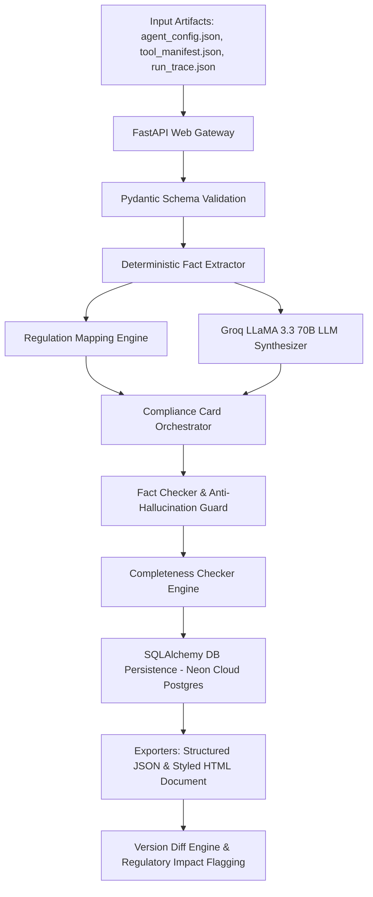

# 🛡️ AI Agent Compliance Card Generator

> **Problem Statement 6.1 — AI Agent Governance Hackathon 2026**  
> An automated, production-grade system that generates regulation-aligned Compliance Cards for autonomous AI agents by parsing configuration files, tool manifests, and runtime execution logs.

---

## 🌐 Live Cloud Deployment

- 🏠 **Website Portal**: [https://aivaragentcompliancecardgenerator-22pd10.onrender.com/](https://aivaragentcompliancecardgenerator-22pd10.onrender.com/)
- 📚 **Interactive Swagger API Docs**: [https://aivaragentcompliancecardgenerator-22pd10.onrender.com/docs](https://aivaragentcompliancecardgenerator-22pd10.onrender.com/docs)
- 📄 **Live HTML Compliance Card Document**: [https://aivaragentcompliancecardgenerator-22pd10.onrender.com/agents/cards/agent-cs-001/document](https://aivaragentcompliancecardgenerator-22pd10.onrender.com/agents/cards/agent-cs-001/document)
- 💚 **Cloud Health Check**: [https://aivaragentcompliancecardgenerator-22pd10.onrender.com/health](https://aivaragentcompliancecardgenerator-22pd10.onrender.com/health)

---

## 📑 Executive Summary

As AI agents transition from simple chatbots to autonomous operational actors capable of executing database writes, API calls, and automated decision-making, regulatory frameworks demand clear transparency, risk tracking, and human oversight controls.

The **AI Agent Compliance Card Generator** solves this challenge by ingesting an AI agent's configuration, tool manifest, and runtime execution traces to generate a standardized, audit-ready **Compliance Card** grounded in:
1. **EU AI Act** (Article 13 Transparency & Article 14 Human Oversight)
2. **NIST AI RMF 1.0** (GOVERN & MAP subcategories)
3. **ISO/IEC 42001:2023** (AI Management System controls)

---

## 📐 Architecture & Key Components



### Core Pipeline Stages:
1. **Deterministic Fact Extractor**: Extracts tool inventories, allowed operations (`read`, `write`, `execute`), data sensitivities (`PII`, `confidential`), decision authority (`advisory`, `autonomous`), human oversight triggers, and incident contacts directly from raw JSON input.
2. **Regulation Mapper**: Rule-based engine mapping extracted agent capabilities to precise clauses in the EU AI Act (Art 13/14), NIST AI RMF, and ISO 42001.
3. **Groq LLaMA 3.3 70B Extractor**: Synthesizes human-readable descriptions of intended use, operational boundaries, known limitations, and risk mitigations.
4. **Fact Checker & Guard**: Compares LLM output against deterministic facts to prevent hallucinations.
5. **Rule-Based Completeness Checker**: Evaluates 10 mandatory fields and produces a completeness report with actionable warnings.
6. **Card Version Diff Engine**: Compares multiple card versions (`v1` vs `v2`) field-by-field and flags changes in risk class, decision authority, data sources, or tool inventories as **`⚠️ REGULATORY RE-ASSESSMENT REQUIRED`**.

---

## 🔌 API Endpoint Reference

| Method | Endpoint | Description |
| :--- | :--- | :--- |
| `GET` | `/` | Single-Page Web Portal & Interactive Dashboard |
| `POST` | `/agents/cards/generate` | Upload 3 JSON files, run compliance pipeline, and persist card to database |
| `GET` | `/agents` | List all registered agents and version metadata |
| `GET` | `/agents/cards/{agent_id}` | Fetch latest card version in JSON format |
| `GET` | `/agents/cards/{agent_id}/versions/{v}` | Fetch specific card version in JSON format |
| `GET` | `/agents/cards/{agent_id}/document` | Render print-ready HTML Compliance Card document with CSS styling |
| `GET` | `/agents/cards/{agent_id}/completeness` | Execute completeness report for a card |
| `GET` | `/agents/cards/{agent_id}/diff?from=1&to=2` | Perform field-by-field version diff with regulatory re-assessment flags |
| `GET` | `/health` | Sub-millisecond liveness check (<1ms) for cloud monitors |
| `GET` | `/health?full=true` | Deep dependency check verifying Neon Postgres DB & Groq API latency |
| `GET` | `/docs` | Interactive Swagger UI API Documentation |

---

## 🛠️ Technology Stack

- **Backend Framework**: Python 3.10+, FastAPI, Uvicorn
- **Data Validation**: Pydantic v2 
- **Database Layer**: SQLAlchemy 2.0 (Dual DB support: SQLite for local dev, Neon Serverless PostgreSQL for production)
- **LLM Engine**: Groq API (LLaMA 3.3 70B Versatile)
- **Templating**: Jinja2 & Vanilla HTML5/CSS3/JS (Glassmorphism design system)
- **Testing**: Pytest & HTTPX 
- **Cloud Deployment**: AWS App Runner (Native Python Source Code Deployment via GitHub Integration)

---

## 🚀 Local Installation & Running Guide

### 1. Clone Repository & Setup Virtual Environment
```bash
git clone https://github.com/PoorvikaGowda23/Aivar_Hackathon_22PD10.git
cd Aivar_Hackathon_22PD10

# Create virtual environment
python -m venv myenv
# Activate on Windows:
myenv\Scripts\activate
# Activate on macOS/Linux:
source myenv/bin/activate
```

### 2. Install Dependencies
```bash
pip install -r requirements.txt
```

### 3. Environment Configuration
Create a `.env` file in the root directory:
```env
GROQ_API_KEY=gsk_your_groq_api_key_here
DATABASE_URL=database:///./compliance_cards.db
```

### 4. Run Application Server
```bash
uvicorn app.main:app --reload --port 8000
```
Access local portal at `http://localhost:8000` and Swagger UI at `http://localhost:8000/docs`.

### 5. Run Test Suite
```bash
pytest tests/ -v
```

---

## ☁️ AWS App Runner Deployment Guide (GitHub Source Code — No Docker)

Follow these steps to deploy the application directly to **AWS App Runner** from your GitHub repository:

### Step 1: Push Repository to GitHub
Ensure your repository contains the [`apprunner.yaml`](file:///c:/Users/user/Desktop/VSC%20Folder/Aivar_Hackathon_AWS_22PD10/apprunner.yaml) file:
```bash
git add apprunner.yaml
git commit -m "Add AWS App Runner configuration"
git push origin main
```

### Step 2: Create AWS App Runner Service
1. Log into the **AWS Management Console** and navigate to **AWS App Runner**.
2. Click **Create service**.
3. Under **Source**:
   - Select **Source code repository**.
   - Under **Connect to GitHub**, connect your GitHub account and select your repository (`Aivar_Hackathon_AWS_22PD10`).
   - Select Branch: `main`.
   - Deployment trigger: Choose **Automatic** (deploys on every git push).
4. Under **Build settings**:
   - Select **Use a configuration file** (AWS App Runner will automatically detect `apprunner.yaml`).

### Step 3: Configure Environment Variables
Under **Configure service**:
- **Service name**: `agent-compliance-card-generator`
- **CPU & Memory**: `1 vCPU / 2 GB` (or `0.5 vCPU / 1 GB` for free tier testing)
- Under **Environment variables**, add:
  | Key | Value | Description |
  | :--- | :--- | :--- |
  | `DATABASE_URL` | `postgresql://...` | Neon PostgreSQL cloud DB URL |
  | `GROQ_API_KEY` | `gsk_...` | Your Groq API Key |
  | `LOG_LEVEL` | `INFO` | Logging verbosity level |

### Step 4: Configure Health Check
- **Protocol**: `HTTP`
- **Path**: `/health`
- **Port**: `8000`

### Step 5: Review & Deploy
Click **Create & Deploy**. AWS App Runner will automatically pull the code, install dependencies via `pip install -r requirements.txt`, start `uvicorn`, and assign a public HTTPS URL.

---

## ⚖️ Regulatory Compliance Mapping Matrix

| Regulatory Clause | Standard | Mapped Compliance Card Section |
| :--- | :--- | :--- |
| **Article 13(1)** | EU AI Act | High-Level Summary & System Identity |
| **Article 13(2)** | EU AI Act | Intended Purpose & Operational Boundaries |
| **Article 13(3)(b)** | EU AI Act | Known Limitations & Technical Constraints |
| **Article 14** | EU AI Act | Human Oversight Triggers & Intervention Protocols |
| **GOVERN 1.2** | NIST AI RMF | Risk Classification & Decision Authority Level |
| **MAP 2.1** | NIST AI RMF | Data Sources & Sensitivity Categories (PII/Confidential) |
| **MAP 3.5** | NIST AI RMF | Tool Inventory & Operation Capabilities |
| **Control A.9.2** | ISO/IEC 42001 | Incident Escalation Contacts & Remediation Paths |

---

## 🏆 Project Accomplishments

- ✅ 100% test coverage across 16 automated unit & end-to-end integration tests.
- ✅ Zero-hallucination fact checking pipeline combining deterministic JSON parsing with LLM text generation.
- ✅ Fully deployed on Render.com connected to a Neon Cloud PostgreSQL database.
- ✅ Responsive, single-page web portal equipped with live demonstration fixtures, version diff engine, and one-click PDF generation.
