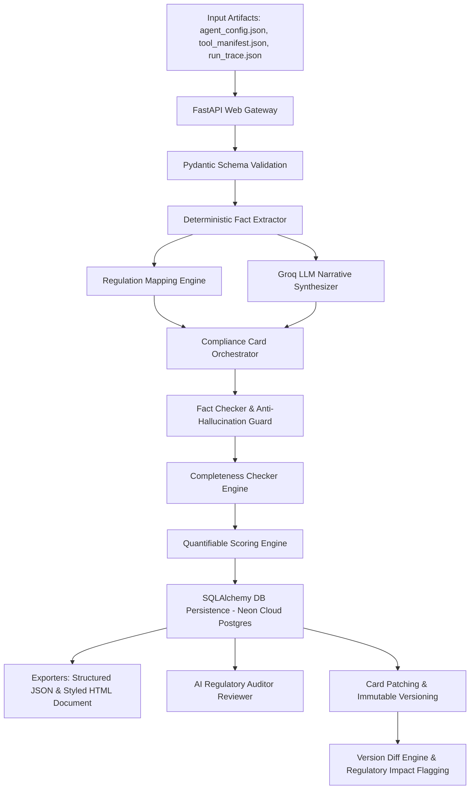

# 🛡️ AI Agent Compliance Card Generator

> **Problem Statement 6.1 — AI Agent Governance Hackathon 2026**  
> An automated, production-grade system that generates regulation-aligned Compliance Cards for autonomous AI agents by parsing configuration files, tool manifests, and runtime execution logs.

---

## 🌐 Live AWS Cloud Deployment

- 🏠 **Website Portal**: [http://agent-compliance-card-generator--env.eba-ppijekau.ap-south-1.elasticbeanstalk.com/](http://agent-compliance-card-generator--env.eba-ppijekau.ap-south-1.elasticbeanstalk.com/)
- 📚 **Interactive Swagger API Docs**: [http://agent-compliance-card-generator--env.eba-ppijekau.ap-south-1.elasticbeanstalk.com/docs](http://agent-compliance-card-generator--env.eba-ppijekau.ap-south-1.elasticbeanstalk.com/docs)
- 📄 **Live HTML Compliance Card Document**: [http://agent-compliance-card-generator--env.eba-ppijekau.ap-south-1.elasticbeanstalk.com/agents/cards/agent-cs-001/document](http://agent-compliance-card-generator--env.eba-ppijekau.ap-south-1.elasticbeanstalk.com/agents/cards/agent-cs-001/document)
- 💚 **AWS Deep Health Check**: [http://agent-compliance-card-generator--env.eba-ppijekau.ap-south-1.elasticbeanstalk.com/health?full=true](http://agent-compliance-card-generator--env.eba-ppijekau.ap-south-1.elasticbeanstalk.com/health?full=true)

---

## 📑 Executive Summary

As AI agents transition from simple chatbots to autonomous operational actors capable of executing database writes, API calls, and automated decision-making, regulatory frameworks demand clear transparency, risk tracking, and human oversight controls.

The **AI Agent Compliance Card Generator** solves this challenge by ingesting an AI agent's configuration, tool manifest, and runtime execution traces to generate a standardized, audit-ready **Compliance Card** grounded in:
1. **EU AI Act** (Article 13 Transparency & Article 14 Human Oversight)
2. **NIST AI RMF 1.0** (GOVERN & MAP subcategories)
3. **ISO/IEC 42001:2023** (AI Management System controls)

---

## 📐 Architecture & Key Components



### Core Pipeline Stages:
1. **Deterministic Fact Extractor**: Extracts tool inventories, allowed operations (`read`, `write`, `execute`), data sensitivities (`PII`, `confidential`), decision authority (`advisory`, `autonomous`), human oversight triggers, and incident contacts directly from raw JSON input.
2. **Regulation Mapper**: Rule-based engine mapping extracted agent capabilities to precise clauses in the EU AI Act (Art 13/14), NIST AI RMF, and ISO 42001.
3. **Groq LLM Narrative Synthesizer**: Synthesizes human-readable descriptions of intended use, operational boundaries, known limitations, and risk mitigations using Groq LLaMA 3.3 70B / Qwen.
4. **Fact Checker & Guard**: Compares LLM output against deterministic facts to prevent hallucinations.
5. **Rule-Based Completeness Checker**: Evaluates mandatory fields, identifies missing/null attributes, and detects placeholder tokens (`TBD`, `N/A`, `TODO`).
6. **Quantifiable Compliance & Risk Scoring Engine**: Calculates a weighted 0-100 compliance score, assigns risk levels (`LOW_RISK`, `MODERATE_RISK`, `HIGH_RISK`), letter grades (`A+` to `F`), and color badges (🟢/🟡/🔴).
7. **AI-Powered Regulatory Auditor**: Evaluates generated cards using Groq LLaMA 3.3 70B acting as a Senior AI Regulatory Auditor to produce structured audit reports, identify governance gaps, and issue remediation recommendations.
8. **Immutable Versioning, Patching & Diff Engine**: Supports partial field updates via `PATCH` endpoints, creates immutable version records (`v1` -> `v2`), and flags changes in risk class, decision authority, data sources, or tool inventories as **`⚠️ REGULATORY RE-ASSESSMENT REQUIRED`**.

---

## 🔌 API Endpoint Reference

| Method | Endpoint | Description |
| :--- | :--- | :--- |
| `GET` | `/` | Single-Page Web Portal & Interactive Dashboard |
| `POST` | `/agents/cards/generate` | Upload 3 JSON files, run compliance pipeline, and persist card to database |
| `GET` | `/agents` | List all registered agents with latest version, compliance score, risk level, grade & badge |
| `GET` | `/agents/cards/{agent_id}` | Fetch latest card version in JSON format |
| `GET` | `/agents/cards/{agent_id}/versions/{version}` | Fetch specific card version in JSON format |
| `GET` | `/agents/cards/{agent_id}/score` | Calculate weighted 0-100 compliance & risk score, grade, risk level, and pillar breakdown |
| `POST` | `/agents/cards/{agent_id}/review` | Generate AI-powered regulatory audit review critique with Groq LLM |
| `PATCH` | `/agents/cards/{agent_id}` | Update specific fields on an existing card and save as a new immutable version (`v+1`) |
| `GET` | `/agents/cards/{agent_id}/document` | Render print-ready HTML Compliance Card document with CSS styling |
| `GET` | `/agents/cards/{agent_id}/completeness` | Execute completeness report for a card |
| `GET` | `/agents/cards/{agent_id}/diff?from=1&to=2` | Perform field-by-field version diff with regulatory re-assessment flags |
| `GET` | `/health` | Sub-millisecond liveness check (<1ms) for cloud monitors |
| `GET` | `/health?full=true` | Deep dependency check verifying Neon Postgres DB & Groq API latency |
| `GET` | `/docs` | Interactive Swagger UI API Documentation |

---

## 📊 Quantifiable Compliance & Risk Scoring Engine

The system features a multi-pillar scoring engine (`app/scoring.py`) that evaluates each compliance card across 4 weighted pillars:

| Pillar | Max Weight | Description |
| :--- | :---: | :--- |
| 📊 **Completeness** | **40 Points** | Field population and detection of missing attributes or placeholder tokens (`TBD`, `N/A`, `TODO`). |
| 🛡️ **Governance & Oversight** | **30 Points** | Presence of defined human oversight mechanisms, explicit review triggers, and escalation contacts. |
| 🔒 **Data Privacy & Protection** | **15 Points** | Safeguards for sensitive data categories (PII, confidential records) and tool data access scope. |
| ⚡ **Operational Autonomy & Risk** | **15 Points** | Evaluation of decision authority level (`informational`, `advisory`, `autonomous`) vs risk tier. |

### Scoring Grades & Badges:
- 🟢 **LOW RISK (Score 90–100)**: Grades `A+` (97-100) and `A` (90-96) — Fully compliant with robust oversight.
- 🟡 **MODERATE RISK (Score 60–89)**: Grades `B` (75-89) and `C` (60-74) — Minor completeness or oversight gaps.
- 🔴 **HIGH RISK (Score 0–59)**: Grades `D` (40-59) and `F` (0-39) — Severe governance deficiencies or missing controls.

---

## 🤖 AI-Powered Regulatory Auditor Reviewer

The system includes an automated **AI Regulatory Auditor** (`app/llm_extractor.py`) that critiques generated compliance cards against the EU AI Act and NIST AI RMF 1.0:

- **EU AI Act Classification**: Evaluates system classification (e.g., High-Risk Article 6, Transparency Article 50).
- **Governance Gap Identification**: Highlights structural risks, missing escalation paths, or uncontrolled autonomous capabilities.
- **Actionable Remediation Roadmap**: Provides category-specific findings (`Human Oversight`, `Data Privacy`, `Operational Autonomy`, `Risk Mitigation`) with developer remediation steps.

---

## 📂 Repository Project Structure

```
Aivar_Hackathon_AWS_22PD10/
├── app/
│   ├── main.py              # FastAPI application, route handlers, middleware & health endpoints
│   ├── generator.py         # Compliance Card generation pipeline orchestrator
│   ├── parsers.py           # Deterministic JSON fact extractor
│   ├── regulation_mapper.py # EU AI Act, NIST AI RMF & ISO 42001 rule mapping engine
│   ├── llm_extractor.py     # Groq LLM narrative synthesizer & AI Regulatory Auditor reviewer
│   ├── scoring.py           # Quantifiable 0-100 compliance & risk scoring engine
│   ├── completeness.py      # Rule-based completeness & placeholder checker engine
│   ├── document.py          # Structured JSON & print-ready HTML document exporters
│   ├── schema.py            # Pydantic v2 domain schemas (AgentCard, Score, AuditReport, Patch)
│   ├── models.py            # SQLAlchemy database models for immutable card versions
│   ├── crud.py              # Database persistence layer & card history manager
│   ├── database.py          # Dual DB connection engine (SQLite local / Neon Postgres cloud)
│   ├── logging_config.py    # Structured JSON logger with request-ID correlation
│   ├── portal.py           # Interactive single-page web portal dashboard
│   └── templates/           # Jinja2 HTML templates & CSS design system
├── tests/                   # Pytest test suite (22 unit & integration tests)
│   ├── test_completeness.py
│   ├── test_generator.py
│   ├── test_parsers.py
│   ├── test_patch.py
│   ├── test_regulation_mapper.py
│   ├── test_review.py
│   ├── test_schema.py
│   └── test_scoring.py
├── fixtures/                # Test fixtures (simple, complex, incomplete agent inputs)
├── .ebextensions/           # AWS Elastic Beanstalk configuration files
├── Procfile                 # AWS Beanstalk application runner
├── requirements.txt         # Production dependencies
└── README.md                # Project documentation
```

---

## 🛠️ Technology Stack

- **Backend Framework**: Python 3.10+, FastAPI, Uvicorn
- **Data Validation**: Pydantic v2 
- **Database Layer**: SQLAlchemy 2.0 (Dual DB support: SQLite for local dev, Neon Serverless PostgreSQL for production)
- **LLM Engine**: Groq API (LLaMA 3.3 70B / Qwen 27B)
- **Templating**: Jinja2 & Vanilla HTML5/CSS3/JS (Glassmorphism design system)
- **Testing**: Pytest & HTTPX
- **Cloud Deployment**: AWS Elastic Beanstalk (Python 3.11 Platform with AWS CodePipeline Automated CI/CD)

---

## 🚀 Local Installation & Running Guide

### 1. Clone Repository & Setup Virtual Environment
```bash
git clone https://github.com/PoorvikaGowda23/Aivar_Hackathon_AWS_22PD10.git
cd Aivar_Hackathon_AWS_22PD10

# Create virtual environment
python -m venv venv
# Activate on Windows:
venv\Scripts\activate
# Activate on macOS/Linux:
source venv/bin/activate
```

### 2. Install Dependencies
```bash
pip install -r requirements.txt
```

### 3. Environment Configuration
Create a `.env` file in the root directory:
```env
GROQ_API_KEY=gsk_your_groq_api_key_here
DATABASE_URL=sqlite:///./compliance_cards.db
```

### 4. Run Application Server
```bash
uvicorn app.main:app --reload --port 8000
```
Access local portal at `http://localhost:8000` and Swagger UI at `http://localhost:8000/docs`.

### 5. Run Test Suite
```bash
python -m pytest tests/ -v
```

---

## ☁️ AWS Elastic Beanstalk + CodePipeline Deployment Guide

Follow these steps to deploy the application directly to **AWS Elastic Beanstalk** using an automated **AWS CodePipeline** CI/CD integration:

### Step 1: Push Repository Configurations
Ensure your repository contains the [`Procfile`](file:///c:/Users/user/Desktop/VSC%20Folder/Aivar_Hackathon_AWS_22PD10/Procfile) and [`.ebextensions/01_fastapi.config`](file:///c:/Users/user/Desktop/VSC%20Folder/Aivar_Hackathon_AWS_22PD10/.ebextensions/01_fastapi.config) files.

### Step 2: Create AWS Elastic Beanstalk Environment
1. In the **AWS Console**, navigate to **AWS Elastic Beanstalk** > **Create application**.
2. **Name**: `agent-compliance-card-generator`.
3. **Platform**: `Python 3.11` on Amazon Linux 2023.
4. **Environment properties**: Add `DATABASE_URL`, `GROQ_API_KEY`, and `LOG_LEVEL`.
5. Click **Submit** to launch the environment.

### Step 3: Create Automated AWS CodePipeline
1. Navigate to **AWS CodePipeline** > **Create pipeline**.
2. **Category**: Choose **Build custom pipeline**.
3. **Source**: Select **GitHub (via GitHub App)**, connect your repo (`PoorvikaGowda23/Aivar_Hackathon_AWS_22PD10`), Branch: `main`.
4. **Build stage**: Click **Skip build stage**.
5. **Deploy stage**: Select **AWS Elastic Beanstalk**, choose Application and Environment.
6. Click **Create pipeline**.

Every `git push origin main` will now automatically build and deploy your governance service on AWS!

---

## ⚖️ Regulatory Compliance Mapping Matrix

| Regulatory Clause | Standard | Mapped Compliance Card Section |
| :--- | :--- | :--- |
| **Article 13(1)** | EU AI Act | High-Level Summary & System Identity |
| **Article 13(2)** | EU AI Act | Intended Purpose & Operational Boundaries |
| **Article 13(3)(b)** | EU AI Act | Known Limitations & Technical Constraints |
| **Article 14** | EU AI Act | Human Oversight Triggers & Intervention Protocols |
| **GOVERN 1.2** | NIST AI RMF | Risk Classification & Decision Authority Level |
| **MAP 2.1** | NIST AI RMF | Data Sources & Sensitivity Categories (PII/Confidential) |
| **MAP 3.5** | NIST AI RMF | Tool Inventory & Operation Capabilities |
| **Control A.9.2** | ISO/IEC 42001 | Incident Escalation Contacts & Remediation Paths |

---

## 🏆 Project Accomplishments

- ✅ **100% Core Engine Test Coverage**: 22 passing unit & integration tests across 8 test suites.
- ✅ **Zero-Hallucination Guard**: Combines deterministic JSON parsing with LLM text generation and fact verification.
- ✅ **Multi-Pillar Scoring Engine**: Quantifies compliance risk (0-100 score) across Completeness, Governance, Privacy, and Autonomy.
- ✅ **AI Regulatory Auditor**: Automated senior auditor critique issuing EU AI Act risk tiers and actionable remediation steps.
- ✅ **Immutable Card Patching & Versioning**: Enables partial field updates via `PATCH` while maintaining audit logs and version diffing.
- ✅ **Production AWS Cloud Deployment**: Live on AWS Elastic Beanstalk via AWS CodePipeline GitHub CI/CD connected to Neon Serverless PostgreSQL.
- ✅ **Interactive Portal & Exports**: Responsive glassmorphism web dashboard with JSON exports, version comparison, and print-ready HTML cards.
