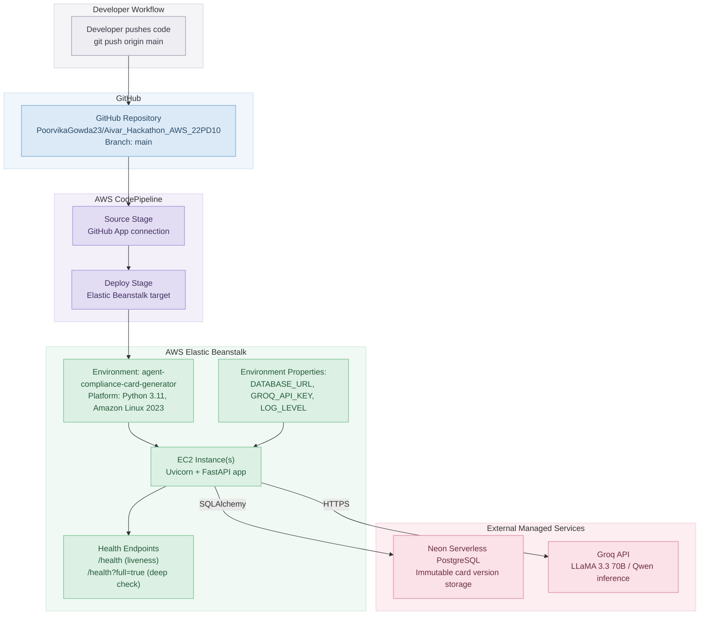

# AWS Cloud Deployment & CI/CD Architecture

This diagram shows how code goes from a `git push` to a live, running deployment, and which external cloud services the running app depends on.

## Flow Summary

| Step | Component | Role |
| :--- | :--- | :--- |
| 1 | Developer | Pushes committed code to `main` branch on GitHub |
| 2 | GitHub | Hosts source; triggers CodePipeline via GitHub App connection |
| 3 | AWS CodePipeline | Source stage pulls latest commit; Deploy stage ships it to Beanstalk (build stage skipped) |
| 4 | AWS Elastic Beanstalk | Provisions/updates EC2 instance(s) running Python 3.11 + Uvicorn + FastAPI, zero-downtime deploy |
| 5 | Environment Properties | Injects `DATABASE_URL`, `GROQ_API_KEY`, `LOG_LEVEL` as runtime env vars |
| 6 | Neon Postgres | External managed DB storing immutable compliance card versions |
| 7 | Groq API | External LLM inference for narrative synthesis and AI Regulatory Auditor review |
| 8 | Health Checks | `/health` for cloud monitor liveness, `/health?full=true` for deep dependency checks (DB + Groq latency) |
