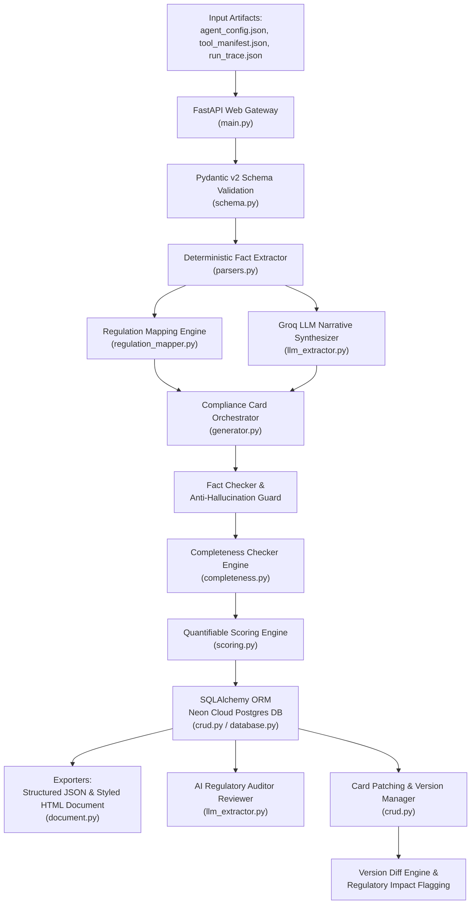

# System & Pipeline Architecture

This diagram shows how a single Compliance Card generation request flows through the application code, from raw JSON upload to stored, exportable output.

## Stage Summary

| Stage | Module | What Happens |
| :--- | :--- | :--- |
| Ingestion | `main.py`, `schema.py` | Uploads validated against Pydantic v2 schemas |
| Fact Extraction | `parsers.py` | Ground-truth tool permissions, PII sensitivity, decision authority, oversight triggers pulled directly from JSON |
| Regulation Mapping | `regulation_mapper.py` | Extracted facts mapped to EU AI Act, NIST AI RMF, ISO 42001 clauses |
| Narrative Synthesis | `llm_extractor.py` | Groq LLaMA 3.3 70B generates purpose/limitations text |
| Verification | Fact Checker Guard, `completeness.py` | LLM output checked against deterministic facts; missing/placeholder fields flagged |
| Scoring | `scoring.py` | 4-pillar weighted score (0–100), grade, risk badge |
| Persistence | `crud.py`, `database.py` | Immutable version saved to Neon Postgres |
| Export & Audit | `document.py`, `llm_extractor.py` | JSON/HTML export; AI Regulatory Auditor review |
| Versioning | `crud.py` | PATCH creates new immutable version; diff engine flags regulatory re-assessment |
